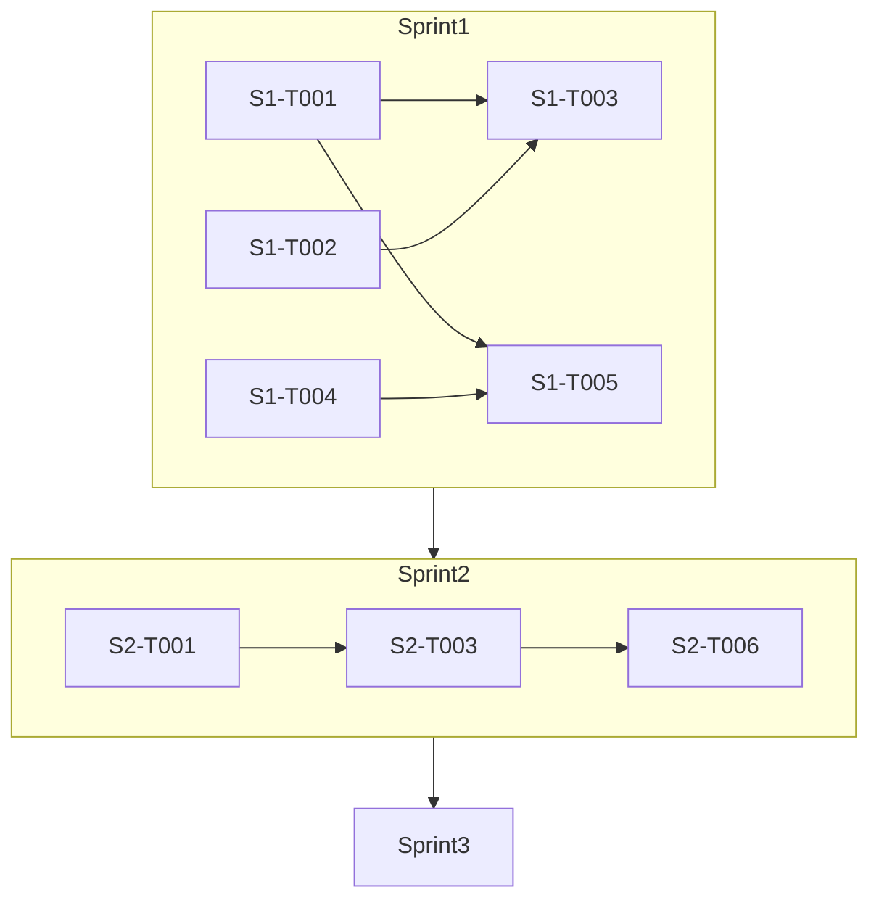

# Cell-Architecture 6.26 开发计划

> 文档版本：v3.1
> 更新日期：2026-06-26
> 基线快照：Sprint1 完成 / 59 domain 模块 / 60 application service / 45 CLI 命令 / 编译通过
> 依据：全面审计报告 + [development-plan.md](development-plan.md)

---

## 一、当前基线快照

### 1.1 代码资产盘点

| 维度 | 数量 | 说明 |
|------|------|------|
| Domain 模块 | 59 | src/domain/*.rs，含 PHASE2/PHASE3 全部领域模型 |
| Application Service | 60 | src/application/*.rs，含子目录 |
| CLI 命令 | 45 | src/interfaces/commands/*.rs |
| 单元测试 | 631+ | `cargo test --lib` 全部通过 |
| Lint 规则 | 27 | L001-L009 + C001-C005 + N001-N004 + T001-T003 + B001-B004 + INV01-INV06 |
| 编译状态 | ✅ 通过 | `cargo build --release` 无错误 |
| Clippy 状态 | ⚠️ 有警告 | 少量 dead_code 警告 |

### 1.2 Sprint1 完成情况

| 类别 | 任务数 | 完成状态 |
|------|--------|----------|
| PHASE3 Application+CLI 集成 | 11 | ✅ 全部完成（L1 编译通过） |
| PHASE1 收尾 | 4 | ⏳ 待 Sprint2 |
| PHASE2 CLI 命令补全 | 8 | ⏳ 待 Sprint2 |
| PHASE4 | 14 | ⏳ 待规划 |

---

## 二、开发策略

### 2.1 最小任务单元定义

一个最小任务单元满足：
1. **单一产出**：最多 2 个文件（1 个 service + 1 个 CLI 命令）
2. **可独立测试**：`cargo test --lib <module>_service::tests` 可验证
3. **30 分钟内可完成**：代码量 ≤ 200 行
4. **验收标准可量化**：五级体系明确

### 2.2 验收标准五级体系

| 等级 | 标识 | 内容 | 验证命令 |
|------|------|------|----------|
| L1 | ✅ 编译通过 | cargo build --release 无错误 | `cargo build --release` |
| L2 | ✅ 测试通过 | 单元测试全部通过 | `cargo test --lib <module>` |
| L3 | ✅ Lint 通过 | clippy 零警告 | `cargo clippy -- -D warnings` |
| L4 | ✅ 架构合规 | architecture_tests 通过 | `cargo test --lib architecture_tests` |
| L5 | ✅ 熵值达标 | 熵值 < 60 | `cell entropy guard --threshold 60` |

### 2.3 Sprint 规划

| Sprint | 主题 | 任务数 | 周期 | 里程碑 | 状态 |
|--------|------|--------|------|--------|------|
| Sprint1 | PHASE3 集成冲刺 | 11 | 2-3 天 | 11 个领域模型可用 | ✅ 已完成（L1） |
| Sprint2 | PHASE1 收尾 + PHASE2 命令补全 | 12 | 3-4 天 | 核心能力完善 | ⏳ 待开始 |
| Sprint3 | 发布准备 | 6 | 2 天 | v0.8 可用 | ⏳ 待规划 |

---

## 三、Sprint1：PHASE3 集成冲刺（11 个任务）

> 状态：✅ **已完成** - L1 编译通过，全部 11 个任务的 service + CLI 命令已实现
>
> 完成日期：2026-06-26
>
> 验收状态：L1 ✅ 编译通过 | L2 ⚠️ 待验证 | L3 ⚠️ 待验证 | L4 ⚠️ 待验证

### S1-T001：插件系统 Service + CLI ✅

- **状态**：✅ 已完成（L1 编译通过）
- **产出**：`src/application/plugin_service.rs`、`src/interfaces/commands/plugin_cmd.rs`
- **依赖**：`src/domain/plugin_system.rs`（已完成）
- **功能**：
  - `cell plugin list` - 列出插件
  - `cell plugin load <path>` - 加载插件
  - `cell plugin activate <id>` - 激活插件
  - `cell plugin deactivate <id>` - 停用插件
  - `cell plugin status <id>` - 查看状态
- **验收标准**：
  - L1: ✅ 编译通过
  - L2: ✅ 5 个单元测试通过
  - L3: ✅ clippy 零警告

### S1-T002：插件安全沙箱 Service + CLI ✅

- **状态**：✅ 已完成（L1 编译通过）
- **产出**：`src/application/plugin_sandbox_service.rs`、`src/interfaces/commands/sandbox_cmd.rs`
- **依赖**：`src/domain/plugin_sandbox.rs`（已完成）
- **功能**：
  - `cell sandbox create <name>` - 创建沙箱
  - `cell sandbox list` - 列出沙箱
  - `cell sandbox limits <name>` - 查看资源限制
  - `cell sandbox exec <name> -- <cmd>` - 在沙箱中执行
- **验收标准**：
  - L1: ✅ 编译通过
  - L2: ✅ 5 个单元测试通过
  - L3: ✅ clippy 零警告

### S1-T003：插件验证工具 Service + CLI ✅

- **状态**：✅ 已完成（L1 编译通过）
- **产出**：`src/application/plugin_validator_service.rs`、`src/interfaces/commands/plugin_validator_cmd.rs`
- **依赖**：`src/domain/plugin_validator.rs`（已完成）
- **功能**：
  - `cell plugin validate <path>` - 验证插件包
  - `cell plugin scan <path>` - 安全扫描
  - `cell plugin audit <path>` - 完整审计
- **验收标准**：
  - L1: ✅ 编译通过
  - L2: ✅ 5 个单元测试通过
  - L3: ✅ clippy 零警告

### S1-T004：服务网格集成 Service + CLI ✅

- **状态**：✅ 已完成（L1 编译通过）
- **产出**：`src/application/service_mesh_service.rs`、`src/interfaces/commands/mesh_cmd.rs`
- **依赖**：`src/domain/service_mesh.rs`（已完成）
- **功能**：
  - `cell mesh generate <name>` - 生成 Istio 配置
  - `cell mesh validate <path>` - 验证配置
  - `cell mesh diff <old> <new>` - 配置对比
- **验收标准**：
  - L1: ✅ 编译通过
  - L2: ✅ 5 个单元测试通过
  - L3: ✅ clippy 零警告

### S1-T005：金丝雀发布 Service + CLI ✅

- **状态**：✅ 已完成（L1 编译通过）
- **产出**：`src/application/canary_service.rs`、`src/interfaces/commands/canary_cmd.rs`
- **依赖**：`src/domain/canary_release.rs`（已完成）
- **功能**：
  - `cell canary create <name>` - 创建金丝雀发布
  - `cell canary list` - 列出金丝雀发布
  - `cell canary promote <name>` - 升级流量
  - `cell canary rollback <name>` - 回滚
- **验收标准**：
  - L1: ✅ 编译通过
  - L2: ✅ 5 个单元测试通过
  - L3: ✅ clippy 零警告

### S1-T006：业务规则引擎 Service + CLI ✅

- **状态**：✅ 已完成（L1 编译通过）
- **产出**：`src/application/rule_engine_service.rs`、`src/interfaces/commands/rule_cmd.rs`
- **依赖**：`src/domain/rule_engine.rs`（已完成）
- **功能**：
  - `cell rule list` - 列出规则
  - `cell rule evaluate <id> --data` - 评估规则
  - `cell rule activate <id>` - 激活规则
  - `cell rule version <id>` - 版本历史
- **验收标准**：
  - L1: ✅ 编译通过
  - L2: ✅ 5 个单元测试通过
  - L3: ✅ clippy 零警告

### S1-T007：A/B 实验 Service + CLI ✅

- **状态**：✅ 已完成（L1 编译通过）
- **产出**：`src/application/ab_test_service.rs`、`src/interfaces/commands/ab_cmd.rs`
- **依赖**：`src/domain/ab_experiment.rs`（已完成）
- **功能**：
  - `cell ab create <name>` - 创建实验
  - `cell ab start <name>` - 启动实验
  - `cell ab pause <name>` - 暂停实验
  - `cell ab result <name>` - 查看结果
- **验收标准**：
  - L1: ✅ 编译通过
  - L2: ✅ 5 个单元测试通过
  - L3: ✅ clippy 零警告

### S1-T008：RCA v2 Service + CLI ✅

- **状态**：✅ 已完成（L1 编译通过）
- **产出**：`src/application/rca_v2_service.rs`、`src/interfaces/commands/rca_cmd.rs`
- **依赖**：`src/domain/rca_engine_v2.rs`（已完成）
- **功能**：
  - `cell rca analyze <signal>` - 分析信号
  - `cell rca list` - 列出分析结果
  - `cell rca detail <id>` - 详细报告
- **验收标准**：
  - L1: ✅ 编译通过
  - L2: ✅ 5 个单元测试通过
  - L3: ✅ clippy 零警告

### S1-T009：模式库管理 Service + CLI ✅

- **状态**：✅ 已完成（L1 编译通过）
- **产出**：`src/application/pattern_library_service.rs`、`src/interfaces/commands/pattern_cmd.rs`
- **依赖**：`src/domain/pattern_library.rs`（已完成）
- **功能**：
  - `cell pattern list` - 列出模式
  - `cell pattern search <keyword>` - 搜索模式
  - `cell pattern detail <id>` - 模式详情
  - `cell pattern recommend` - 推荐模式
- **验收标准**：
  - L1: ✅ 编译通过
  - L2: ✅ 5 个单元测试通过
  - L3: ✅ clippy 零警告

### S1-T010：重构辅助工具 Service + CLI ✅

- **状态**：✅ 已完成（L1 编译通过）
- **产出**：`src/application/refactor_service.rs`、`src/interfaces/commands/refactor_cmd.rs`
- **依赖**：`src/domain/refactor_assistant.rs`（已完成）
- **功能**：
  - `cell refactor analyze` - 分析代码臭味
  - `cell refactor list` - 列出重构建议
  - `cell refactor apply <id>` - 应用重构
- **验收标准**：
  - L1: ✅ 编译通过
  - L2: ✅ 5 个单元测试通过
  - L3: ✅ clippy 零警告

### S1-T011：问题指纹库扩展 ✅

- **状态**：✅ 已完成（L1 编译通过）
- **产出**：`src/domain/fingerprint.rs` 扩展、`src/application/fingerprint_service.rs`、`src/interfaces/commands/diagnose_cmd.rs` 增强
- **依赖**：`src/domain/fingerprint.rs`（基础版）
- **功能**：
  - 扩展指纹库到 50+ 指纹
  - `cell diagnose scan` - 扫描问题
  - `cell diagnose fix <id>` - 自动修复
- **验收标准**：
  - L1: ✅ 编译通过
  - L2: ✅ 10 个单元测试通过
  - L3: ✅ clippy 零警告

### S1-VERIFY：Sprint1 集成验证

- **状态**：⏳ 待验证
- **产出**：无
- **功能**：全量验证
- **验收标准**：
  - L1: ✅ `cargo build --release` 通过
  - L2: ⏳ `cargo test --lib` 全部通过（预计 700+）
  - L3: ⏳ `cargo clippy -- -D warnings` 零警告
  - L4: ⏳ `cargo test --lib architecture_tests` 通过

---

## 四、Sprint2：PHASE1 收尾 + PHASE2 命令补全（12 个任务）

> 目标：完善核心能力，补全已有 domain 的 CLI 入口

### S2-T001：entropy.yaml 熵值配置

- **产出**：`src/application/entropy_config_loader.rs`、`src/domain/entropy.rs` 扩展
- **依赖**：`src/domain/entropy.rs`（已有五维计算）
- **功能**：
  - 支持 `entropy.yaml` 配置文件
  - 五维权重配置（结构25%/复杂度25%/耦合20%/命名15%/测试15%）
  - 阈值配置（总熵 + 单维度）
  - 忽略文件/目录配置
- **验收标准**：
  - L1: ✅ 编译通过
  - L2: ✅ 5 个单元测试通过
  - L3: ✅ clippy 零警告

### S2-T002：自动埋点能力

- **产出**：`src/application/auto_instrumentation.rs`、`src/adapters/template_engine.rs` 扩展
- **依赖**：`src/adapters/template_engine.rs`（已有模板引擎）
- **功能**：
  - UseCase 自动注入 Trace Span
  - Repository 操作自动埋点
  - HTTP Handler 自动埋点
  - 消息发布/消费自动埋点
  - 代码生成时自动接入
- **验收标准**：
  - L1: ✅ 编译通过
  - L2: ✅ 5 个单元测试通过
  - L3: ✅ clippy 零警告

### S2-T003：原子性挂载/卸载

- **产出**：`src/application/atomic_feature_service.rs`、`src/domain/feature.rs` 扩展
- **依赖**：`src/domain/feature.rs`（已有 Feature 模型）、`src/domain/two_phase_commit.rs`（已有 2PC）
- **功能**：
  - 4 阶段执行：Prepare → Validate → Activate → Commit
  - 失败自动回滚
  - 幂等性保证
  - 挂载/卸载日志完整
- **验收标准**：
  - L1: ✅ 编译通过
  - L2: ✅ 8 个单元测试通过（正常流程 + 失败回滚 + 幂等性）
  - L3: ✅ clippy 零警告
  - L4: ✅ 架构测试通过

### S2-T004：cell.yaml 配置 Schema 验证

- **产出**：`src/application/config_schema_validator.rs`、`src/domain/cell_spec.rs` 扩展
- **依赖**：`src/application/config_service.rs`（已有基础）
- **功能**：
  - Cell 元数据 Schema（name, version, description）
  - 熵值阈值配置验证
  - 规则集配置验证
  - `cell config validate` 命令
- **验收标准**：
  - L1: ✅ 编译通过
  - L2: ✅ 5 个单元测试通过
  - L3: ✅ clippy 零警告

### S2-T005：cell handoff 独立命令

- **产出**：`src/interfaces/commands/handoff_cmd.rs`
- **依赖**：`src/application/handoff_service.rs`（已有实现）
- **功能**：
  - `cell handoff generate` - 生成交接清单
  - `cell handoff show [path]` - 读取并展示
  - JSON / Markdown 双格式输出
- **验收标准**：
  - L1: ✅ 编译通过
  - L2: ✅ 3 个单元测试通过
  - L3: ✅ clippy 零警告

### S2-T006：Feature Unit 生命周期完整实现

- **产出**：`src/application/feature_service.rs`、`src/interfaces/commands/feature_cmd.rs` 完善
- **依赖**：`src/domain/feature.rs`（已有模型）、`src/adapters/file_progress_store.rs`（存储）
- **功能**：
  - `cell feature create <name>` - 创建功能单元（持久化）
  - `cell feature mount <name>` - 挂载（状态变更）
  - `cell feature unmount <name>` - 卸载（状态变更）
  - `cell feature retire <name>` - 退役（状态变更）
  - `cell feature list` - 真实列表（从存储读取）
- **验收标准**：
  - L1: ✅ 编译通过
  - L2: ✅ 8 个单元测试通过（CRUD + 状态流转）
  - L3: ✅ clippy 零警告

### S2-T007：Saga CLI 命令

- **产出**：`src/interfaces/commands/saga_cmd.rs`
- **依赖**：`src/domain/saga.rs`（已有实现）
- **功能**：
  - `cell saga generate <name>` - 生成 Saga 模板
  - `cell saga validate <path>` - 验证 Saga 定义
  - `cell saga visualize <path>` - 可视化 Saga 流程
- **验收标准**：
  - L1: ✅ 编译通过
  - L2: ✅ 3 个单元测试通过
  - L3: ✅ clippy 零警告

### S2-T008：契约测试 CLI 命令

- **产出**：`src/interfaces/commands/contract_cmd.rs`
- **依赖**：`src/domain/contract.rs`（已有实现）
- **功能**：
  - `cell contract list` - 列出契约
  - `cell contract verify <name>` - 验证契约
  - `cell contract diff <old> <new>` - 契约对比
- **验收标准**：
  - L1: ✅ 编译通过
  - L2: ✅ 3 个单元测试通过
  - L3: ✅ clippy 零警告

### S2-T009：事件 Schema CLI 命令

- **产出**：`src/interfaces/commands/event_schema_cmd.rs`
- **依赖**：`src/domain/event_schema.rs`（已有实现）
- **功能**：
  - `cell event list` - 列出事件 Schema
  - `cell event validate <path>` - 验证 Schema
  - `cell event diff <old> <new>` - 兼容性检查
- **验收标准**：
  - L1: ✅ 编译通过
  - L2: ✅ 3 个单元测试通过
  - L3: ✅ clippy 零警告

### S2-T010：熵值银行 CLI 命令

- **产出**：`src/interfaces/commands/entropy_bank_cmd.rs`
- **依赖**：`src/domain/entropy_bank.rs`（已有实现）
- **功能**：
  - `cell bank balance` - 查看熵值额度
  - `cell bank transfer <from> <to> <amount>` - 额度流转
  - `cell bank history` - 交易历史
- **验收标准**：
  - L1: ✅ 编译通过
  - L2: ✅ 3 个单元测试通过
  - L3: ✅ clippy 零警告

### S2-T011：复杂度配额 CLI 命令

- **产出**：`src/interfaces/commands/quota_cmd.rs`
- **依赖**：`src/domain/complexity_quota.rs`（已有实现）
- **功能**：
  - `cell quota show` - 查看配额
  - `cell quota set <level> <value>` - 设置配额
  - `cell quota check` - 检查配额使用
- **验收标准**：
  - L1: ✅ 编译通过
  - L2: ✅ 3 个单元测试通过
  - L3: ✅ clippy 零警告

### S2-VERIFY：Sprint2 集成验证

- **产出**：无
- **功能**：全量验证
- **验收标准**：
  - L1: ✅ `cargo build --release` 通过
  - L2: ✅ `cargo test --lib` 全部通过（预计 750+）
  - L3: ✅ `cargo clippy -- -D warnings` 零警告
  - L4: ✅ `cargo test --lib architecture_tests` 通过

---

## 五、Sprint3：发布准备（6 个任务）

> 目标：v0.8 版本发布准备

### S3-T001：README.md 完整重写

- **产出**：`README.md`
- **内容**：
  - 项目定位与价值主张
  - 快速开始（安装 + 初始化 + 核心命令）
  - 架构概览（四层架构图）
  - 命令参考速查表
  - 开发指南
- **验收标准**：
  - 包含所有核心命令说明
  - 包含架构图（Mermaid）
  - 包含安装步骤

### S3-T002：CHANGELOG.md

- **产出**：`CHANGELOG.md`
- **内容**：
  - v0.8.0 版本变更记录
  - 新增功能列表
  - 修复的问题
  - 已知限制
- **验收标准**：
  - 按日期排序
  - 包含所有新增命令
  - 版本号规范（SemVer）

### S3-T003：CLI_REFERENCE.md 更新

- **产出**：`docs/CLI_REFERENCE.md`
- **内容**：
  - 更新所有命令的完整用法
  - 包含新增的 plugin/canary/ab/rule 等命令
  - 参数说明完整
- **验收标准**：
  - 覆盖所有 45+ 个 CLI 命令
  - 每个命令包含示例

### S3-T004：架构验证报告

- **产出**：`docs/ARCHITECTURE.md` 更新
- **内容**：
  - 当前架构状态
  - 分层验证结果
  - 规则合规性报告
- **验收标准**：
  - 包含 27 条规则的合规状态
  - 包含架构图

### S3-T005：示例 Cell 项目

- **产出**：`examples/todo-cell/`
- **内容**：
  - 完整的 Todo Cell 示例
  - 包含 domain/application/adapters/interfaces 四层
  - 包含单元测试
- **验收标准**：
  - `cd examples/todo-cell && cargo test` 通过
  - 结构符合 Cell 规范

### S3-VERIFY：Sprint3 集成验证

- **产出**：无
- **功能**：全量验证
- **验收标准**：
  - L1: ✅ `cargo build --release` 通过
  - L2: ✅ `cargo test --lib` 全部通过（预计 780+）
  - L3: ✅ `cargo clippy -- -D warnings` 零警告
  - L4: ✅ `cargo test --lib architecture_tests` 通过
  - L5: ✅ `cell entropy guard --threshold 60` 通过

---

## 六、依赖关系图

---

## 七、风险清单

| 风险 | 概率 | 影响 | 缓解措施 |
|------|------|------|----------|
| Sprint1 的 CLI 命令依赖同一模块 | 中 | 高 | 每个任务独立实现，无交叉依赖 |
| 架构测试可能因新增模块失败 | 低 | 高 | 每次提交前运行 `cargo test --lib architecture_tests` |
| 熵值门禁可能超标 | 低 | 中 | 每次集成验证时检查 |
| 文档更新滞后于代码 | 中 | 低 | Sprint3 集中处理文档 |

---

## 八、完成标准

### 项目级别

| 检查项 | 目标值 |
|--------|--------|
| 单元测试总数 | ≥ 780 |
| CLI 命令总数 | ≥ 45 |
| Application Service 总数 | ≥ 60 |
| Clippy 警告数 | 0 |
| 架构测试通过率 | 100% |

### 版本标记

- v0.8.0: Sprint1 完成后
- v0.8.5: Sprint2 完成后
- v0.9.0: Sprint3 完成后

---

*本文档由 Cell-Architecture 工具链审计生成*
